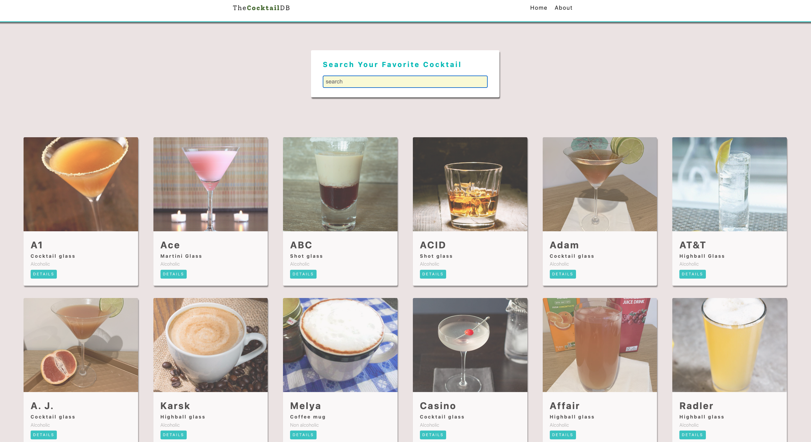

# 🍸✨🍸Cocktail App

This is a React application that allows users to search for cocktails and view detailed information about each one.
The application utilizes the [TheCocktailDB API](https://www.thecocktaildb.com/) to fetch cocktail details.

## 📸 Screenshot




## 💡 Context API

The app uses React's Context API to manage global state, making it easy to manage search terms and cocktail lists across multiple components. This global state is accessed using the `useGlobalContext` hook.

Context allows data to be shared across the component tree without the need to manually pass properties at each level.

For more info, go through the react documentation: (https://reactjs.org/docs/context.html)

👀 The application has been deployed using GitHub Pages and can be viewer by [clicking here](https://JCJetz.github.io/Ejercicios_y_proyectos_Bootcamp/proyectos/cocktailDB-app/)

## 🔑 Features

- **Search Cocktails**: Users can search for their favorite cocktails using a search form.
- **View Cocktail Details**: Users can click on a cocktail from the search results to see more details.
- **Responsive Design**: The app is designed to be responsive and works across different screen sizes.

## 🛠️ Technologies Used

- **React**: A JavaScript library for building user interfaces.
- **React Router**: Used for handling multi-page navigation within the app.
- **TheCocktailDB API**: An open database of cocktail recipes and details.

## ⚙️ Components

### Main Components

- **App**: The main component that sets up routing and renders the Navbar and various pages.
- **SingleCocktail**: Fetches and displays information for a single cocktail based on its ID from the URL.
- **Home**: The homepage displaying the search form and the cocktail list.

### Sub-components

- **Navbar**: Displays navigation links.
- **Loading**: A loading spinner that appears when data is being fetched.
- **CocktailList**: Displays a list of cocktails based on search criteria.
- **Cocktail**: A single cocktail item in the list.
- **SearchForm**: A form that allows users to search for cocktails.

## Pages

- **Home**: The main landing page where users can search for cocktails.
- **About**: A simple page providing information about the app.
- **SingleCocktail**: Displays detailed information about a selected cocktail.
- **Error**: A fallback page that appears when a user navigates to an undefined route.

## 🚧 Setup and Installation

1. **Clone the Repository**:
   ```bash
   git clone https://github.com/yourusername/cocktail-app.git
   cd cocktail-app
   ```
   
2. **Install Dependencies**:
   ```bash
   npm install
   ```
   
3. **Run the App**:
   ```bash
   npm start
   ```
   The application will start on `http://localhost:3000`.


