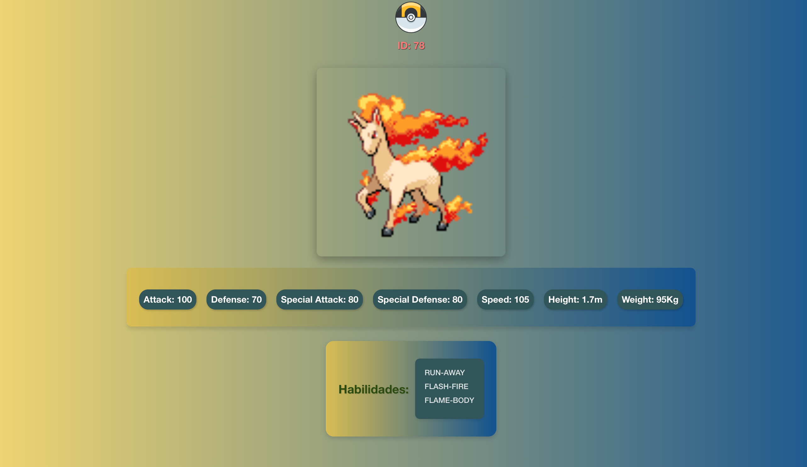
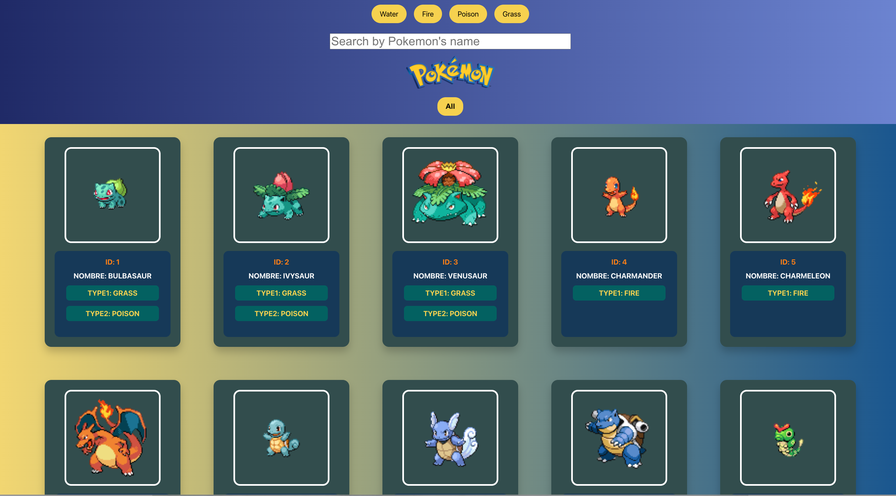

# React Pokemon App

This is a straightforward and user-friendly React application that interacts with the Pokémon API, enabling users to view, search, and filter Pokémon.

## 📸 Screenshot

## ✨ Features

- **View All Pokémon**: Display all available Pokémon using a card-style layout.
- **Search Functionality**: Quickly find Pokémon by typing their name.
- **Detailed View**: Click on a Pokémon to see more detailed information.
- **Refresh Capability**: Reload the Pokémon list with a simple refresh button.
- **Navigation**: Use the home button to return to the main page from the details view.

## ⚙️ Components

- **PokeList**: The central component fetching and storing Pokémon data from the API. It includes search, filter, and refresh functionalities.
  
- **PokeCard**: Renders each Pokémon in a card style, showing the image, name, and type. Clicking a card fetches detailed information about the Pokémon.
  
- **Details**: Displays comprehensive information about a selected Pokémon, such as attack, defense, abilities, height, and weight. It fetches detailed data using the Pokémon's ID.
  
- **Nav**: Renders the navigation bar, handling search terms and filters, then passing them to `PokeList` for filtering Pokémon.

- **Footer**: The footer component with link to my github.

## 🔍 How it Works

1. **Data Fetching**: The app uses React's `useEffect` to fetch data from the [Pokémon API](https://pokeapi.co/api/v2/pokemon?limit=120).

2. **Data Handling**: Utilizes the Fetch API to retrieve data and then converts it to JSON. The data is stored in a state using the `useState` hook.

3. **Rendering Information**: Each Pokémon's ID, name, types, image, and stats are extracted and rendered.

4. **Search and Filter**: The app supports searching Pokémon based on user input, filtering the Pokémon list to match the search query.

5. **Detailed View**: Clicking a Pokémon card triggers a detailed fetch, revealing stats, height, weight, abilities, and more on a separate details page.

## 🚧 Setup and Installation

Follow the steps below to run the project on your local machine:

* Clone the repository from GitHub
* Run `npm install` or `yarn install` to install all dependencies
* Run `npm start` or `yarn start` to launch the application in your browser

